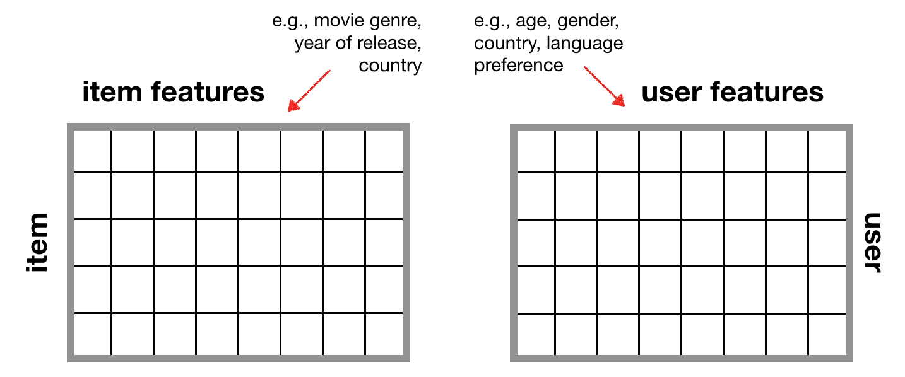

### What is a recommendation system?

A recommendation system is an algorithm that predicts a user's preference toward an item. In most cases, its goal is to **drive user engagement**.  

**Examples:**

- recommending products based on past purchases or product searches (Amazon)
- suggesting TV shows or movies based on prediction of a user's interests (Netflix)
- creating well-curated playlists based on song history (Spotify)
- personalized ads based on "liked" posts or previous websites visited (Facebook)

The two most common recommendation system techniques are: 1) collaborative filtering, and 2) content-based filtering.

### Collaborative Filtering 

Collaborative filering (CF) is based on the concept of "homophily" - similar users like similar things. It uses item preferences from other users to predict which item a particular user will like best. Collaborative filtering uses a user-item matrix to generate recommendations. This matrix is populated with values that indicate a given user's preference towards a given item. It's very unlikely that a user will have interacted with every item, so in most real-life cases, the user-item matrix is very sparse.

Collaborative filtering can be further divided into two categories: memory-based and model-based.

- **Memory-based** algorithms look at item-item, user-item, or user-user similarity using different similarity metrics such as Pearson correlation coefficient, cosine similarity, etc. This approach is easy to apply to your user-item matrix and very interpretable. However, its performance decreases as the dataset becomes more sparse. 
- **Model-based** algorithms use matrix factorization techniques such as Single Vector Decomposition ([SVD](https://www.wikiwand.com/en/Singular-value_decomposition)) and Non-negative Matrix Factorization ([NMF](https://www.wikiwand.com/en/Non-negative_matrix_factorization)) to extract latent/hidden, meaningful factors from the data.

A major disadvantage of collaborative filtering is the **cold start problem**. You can only get recommendations for users and items that already have "interactions" in the user-item matrix. Collaborative filtering fails to provide personalized recommendations for brand new users or newly released items.

### Content-based Filtering

Content-based filtering generates recommendations based on user and item features. Given a set of item features (movie genre, release date, country, language, etc.), it predicts how a user will rate an item based on their ratings of previous movies. 

Content-based filtering handles the "cold start" problem because it is able to provide personalized recommendations for brand new users and features. 

### How do we define a user's "preference" towards an item?

There are two types of feedback data:

1. Explicit feedback, which considers a user's direct response to an item (e.g., rating, like/dislike)

2. Implicit feedback, which looks at a user's indirect behaviour towards an item (e.g., number of times a user has watched a movie)

Before using this data in your recommendation system, it is important to perform some data pre-processing. For example, you should normalize ratings of different users to the same scale. More information on how to normalize data in recommendation systems is described [here](https://www.cs.purdue.edu/homes/lsi/sigir04-cf-norm.pdf).